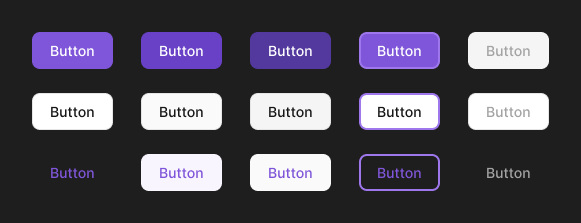
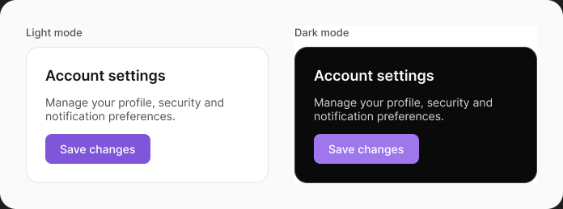
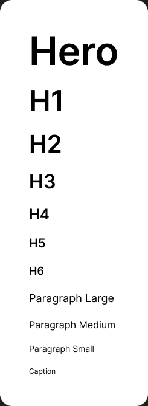

# Design Tokens Starter — a Figma Design System skill for Claude

A [Claude](https://claude.com/claude-code) **skill** that builds a complete, production-grade design system **directly in Figma** — a full multi-tier token architecture *and* token-bound components — by driving the Figma Plugin API through the Figma MCP. No manual JSON wrangling, no Token Studio export/import dance.

You give Claude a color palette and a Figma file. It builds the variables, modes, text styles, and components, all properly connected.

## See it in action

Real output from the skill in a Figma file:

**Button — every state, bound to tokens** (no hardcoded hex; the Focused column shows the `border/focus` ring, Disabled uses `surface/disabled`, the ghost row is Tertiary)



**Light / Dark — one component, two modes** (the same card, with the `Mapped` collection set to Light vs Dark — colors resolve through `Mapped → Alias → Brand`)



**Type scale — bound text styles** (Hero → Caption, each style bound to the Responsive `font-size` / `line-height` variables)



---

## What you get

Running the skill produces a real, fully-wired token system in your Figma file:

```
Brand (primitives)      Alias (semantic)          Mapped (component)         Responsive (type)
raw hex scales     →    role → Brand         →    intent+state → Alias  →    font-size / line-height /
50–950, by hue          primary / secondary /     surface / text /           paragraph-spacing
(e.g. Violet/600)       success / error / …       icon / border              × Desktop / Mobile modes
                        (aliased to Brand)        × Light / Dark modes        feeds bound text styles
```

- **Brand** — your raw color scales, one variable per hue/step, plus `font-family` / `font-weight`.
- **Alias** — semantic roles (`primary`, `secondary`, `info`, `success`, `warning`, `error`, `accent`…), each aliased to a Brand scale.
- **Mapped** — the tokens components actually use: `surface/*`, `text/*`, `icon/*`, `border/*`, with **Light and Dark** values in one collection.
- **Responsive** — a numeric type scale (`font-size`/`line-height`/`paragraph-spacing`) across **Desktop and Mobile**, with body locked at 16px for accessibility.
- **Text styles** — Hero, H1–H6, Paragraph L/M/S, Caption — bound to the Responsive variables.
- **Components** — token-bound components (Button with all states, Input, Card…) whose every fill, border, and label color references a Mapped token.

Because everything is connected through `Mapped → Alias → Brand`, **changing one base color updates the entire system**, and flipping a frame's mode to Dark re-themes every component automatically.

> Why this and not Figma's "Import variables" JSON? Native import can't resolve **cross-collection references** (aliases) — your `Mapped → Alias → Brand` chains break or flatten. That's the #1 reason token imports "don't work." This skill writes the variables and their aliases directly via the Plugin API, so the links are real and the modes are clean from the start.

---

## Prerequisites

1. **Claude Code** (CLI, desktop app, or IDE extension) — this is where the skill runs.
2. **The Figma MCP server connected to Claude.** The skill writes to Figma through Figma's official MCP (`use_figma`). Connect it from the [Figma MCP catalog](https://www.figma.com/blog/introducing-figma-mcp-server/) / your Figma settings and authorize it in Claude.
3. **A Figma design file** open, and its URL (you'll paste the `figma.com/design/...` link).
4. **Figma Professional tier (or higher)** if you want Light/Dark and Desktop/Mobile **modes** — multiple modes per collection is a paid feature. The skill detects this and degrades gracefully otherwise.

---

## Installation

Pick whichever you prefer.

### Option A — the packaged `.skill` file (easiest)

Download **[`design-tokens-starter.skill`](design-tokens-starter.skill)** from this repo and install it in the Claude app (**Settings → Capabilities / Skills → add a skill**). A `.skill` file is just a zip — if your client has no import button, rename it to `.zip` and unzip it into your skills folder (see Option B for the location). Then start a new session.

### Option B — copy the folder manually

Claude Code loads personal skills from a `skills` folder in your Claude config directory. Drop the `design-tokens-starter` folder there:

**macOS / Linux**
```bash
git clone https://github.com/fatcolors/skill-design-tokens-starter.git
cp -r skill-design-tokens-starter/design-tokens-starter ~/.claude/skills/
```

**Windows (PowerShell)**
```powershell
git clone https://github.com/fatcolors/skill-design-tokens-starter.git
Copy-Item -Recurse skill-design-tokens-starter\design-tokens-starter "$env:USERPROFILE\.claude\skills\"
```

Then **start a new Claude Code session** so it picks up the skill. You should now have `design-tokens-starter` available. To confirm, ask Claude: *"what skills do you have for Figma design tokens?"*

> The folder that must end up at `~/.claude/skills/design-tokens-starter/` contains `SKILL.md` and a `references/` folder. Keep them together.

---

## How to run it

You don't invoke anything special — just describe what you want and the skill triggers. Always include your **Figma file URL**.

**Build the whole token system from a palette:**
```
Build a design token system in https://www.figma.com/design/XXXX/My-File from this palette:
gray, slate, violet, red, orange, green, blue (50–950 hex below). Use violet as the brand/primary.
You pick the accent and role mapping — don't ask me a bunch of questions.
<paste your hex values, or attach a Figma variables / Token Studio JSON export>
```

**Or point it at scales you already have in Figma:**
```
I have my raw color scales on a frame in this Figma file <URL>. Read them and turn them into a
proper Brand → Alias → Mapped (light/dark) → Responsive token system.
```

The skill will inspect the file, then build Brand → Alias → Mapped → Responsive, create the bound text styles, hide the primitives from the picker, and (optionally) drop a Light/Dark demo card so you can see it working.

---

## Creating components — and why they "just connect"

Once the tokens exist, building a component is a one-liner:

```
Create a Button component in the same file with all the necessary states, using the variables we created.
```

```
Add an Input component (default / focus / error / disabled) bound to the tokens.
```

Every color the component uses is bound to a **Mapped** token (`surface/brand`, `text/on-brand`, `border/focus`, …) — never a hardcoded hex. The practical payoff:

- **Theming is free.** Put the component on a frame, switch that frame's Mapped mode to **Dark**, and it re-themes — no extra work.
- **One source of truth.** Tweak a base color in **Brand** and every component that uses it updates through the alias chain.
- **New components stay in the system.** Anything you ask the skill to build references the tokens automatically, so your library never drifts into detached hex values.

A worked example (a 15-variant Button: Type × State, with an editable Label property) and the full component recipe live in [`design-tokens-starter/references/components.md`](design-tokens-starter/references/components.md).

---

## What's in the box

```
design-tokens-starter/
├── SKILL.md                      # the workflow Claude follows
└── references/
    ├── architecture.md           # tier rules, role mapping, default token set, scope table
    ├── generation-recipe.md      # the exact Plugin-API snippets, step by step
    ├── palette-input.md          # accepting DTCG / hex / Figma-frame / seed palettes
    └── components.md             # building token-bound components (variant matrices, bindings)
```

---

## Customizing

- **Tiers** — 3-tier (Brand → Alias → Mapped) is the default; a 2-tier (primitive → semantic) variant is supported. See `architecture.md`.
- **Scale** — the skill keeps your palette's own steps and names (50–950, 100–1200, whatever you use) rather than renumbering.
- **Roles & accent** — tell it your mapping, or say "you choose" and it picks sensible defaults and states them.
- **Token set** — `architecture.md` documents a solid default Mapped set; extend or trim per your design.

---

## Troubleshooting

- **"It only made one collection / references are broken"** — that's the native-import failure mode. This skill avoids it by writing aliases via the Plugin API; make sure the Figma MCP is connected and you're letting the skill run (not importing JSON manually).
- **"Adding a second mode failed"** — Light/Dark and Desktop/Mobile modes need Figma Professional or higher. On a free/starter team, `addMode` is blocked; the skill will fall back or warn.
- **Skill didn't trigger** — start a fresh Claude session after installing, and mention Figma + design tokens/variables/components explicitly.
- **Nothing happens in Figma** — confirm the Figma MCP is authorized in Claude and that you pasted the file's `figma.com/design/...` URL.

---

## How it works (under the hood)

The skill follows a strict, validated order — inspect the file → Brand → Alias (aliased to Brand) → Mapped (Light/Dark, aliased to Alias) → Responsive (Desktop/Mobile) → text styles → hide primitives → components. It works incrementally (small, sequential Plugin-API calls), validates each tier by resolving the full reference chain, and returns IDs so later steps stay connected. The methodology is inspired by the three-tier "brand / alias / mapped" approach popularized by the design-systems community.

---

## License

MIT — use it, fork it, build on it.
